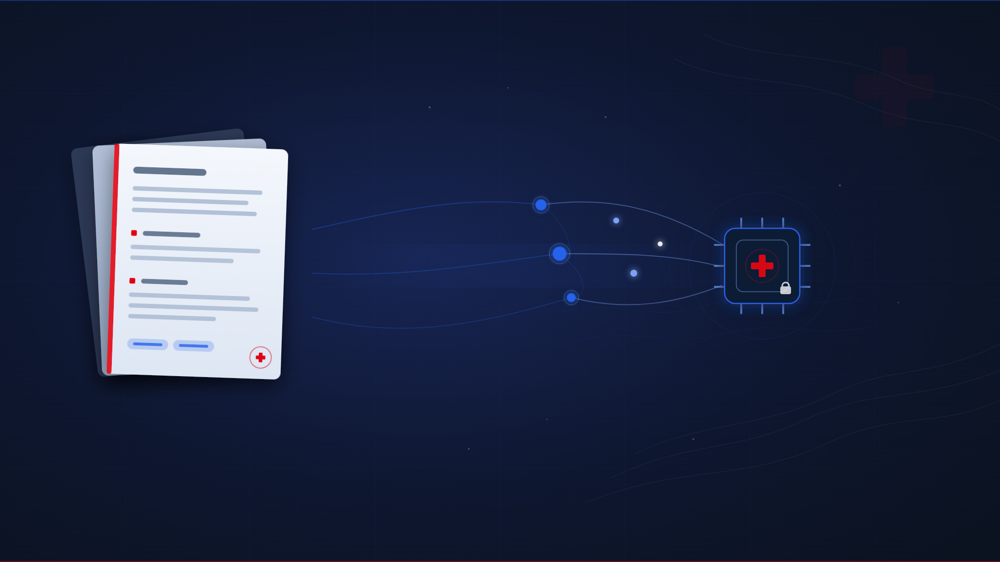
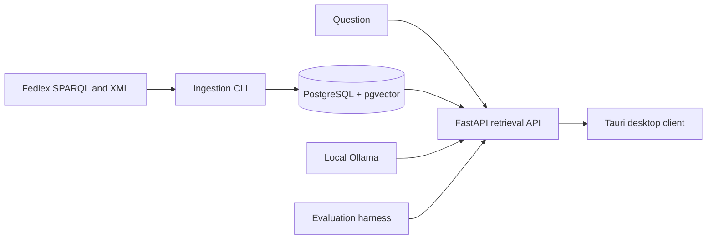

<p align="center">
  
</p>

<div align="center">

# Swiss Legal RAG

### Local, cited answers over Swiss federal law

[](#project-status)
[](#requirements)
[](#requirements)
[](LICENSE)

Ask in German, French, Italian, or another detected language. Retrieve official Fedlex articles. Receive a local, streamed answer with article-level citations.

**[Quick start](#quick-start)** · **[Architecture](#architecture)** · **[Evaluation](#evaluation)** · **[Security](#security)** · **[Contributing](CONTRIBUTING.md)**

</div>

> [!WARNING]
> **Not legal advice.** Swiss Legal RAG is a research and educational project. Generated answers can be incomplete, incorrect, or outdated. Always verify the linked official Fedlex text before relying on an answer.

## Why it exists

Swiss federal law is published across multiple official languages and changes over time. This project is an end-to-end reference implementation for trustworthy local RAG: it ingests official structured legal text, retrieves evidence with hybrid search, requires article-level citations, and evaluates the result with a version-controlled gold dataset.

It is designed for a trusted local user, not for an internet-facing legal service.

## Highlights

| Capability | What it does |
| --- | --- |
| Cross-lingual retrieval | Searches German, French, and Italian federal-law texts; dense retrieval supports questions beyond the FTS languages. |
| Evidence-first answers | Gives the model only retrieved source blocks and refuses deterministically when no source is retrieved. |
| Hybrid retrieval | Combines pgvector cosine search, PostgreSQL full-text search, reciprocal-rank fusion, and a cross-encoder reranker. |
| Traceable output | Uses `[SR <number> Art. <article>]` citations resolved to official Fedlex ELI links. |
| Local desktop workflow | Tauri + React client with a five-language UI, persistent conversation history, in-app corpus search with article preview, and streamed answers with progress feedback for corpus ingestion. |
| Measurable quality | A 33-question DE/FR/IT seed dataset measures retrieval, citations, keywords, and refusal behavior. |

## Architecture



```text
apps/
  ingestion/   Resolve -> fetch -> parse -> embed CLI
  retrieval/   FastAPI hybrid search and SSE RAG API
  desktop/     Tauri 2 + React local client
  evals/       Gold dataset, scoring, comparison, and draft tooling
db/init/       PostgreSQL + pgvector bootstrap SQL
corpus.yaml    Selected federal acts and source metadata
```

## Quick start

### Requirements

- Docker with Compose
- [Ollama](https://ollama.com)
- Python 3.12+
- Node.js 20.19+ or 22.12+ with pnpm
- Rust only when building the Tauri desktop shell

### 1. Start local services

```bash
cp .env.example .env
docker compose up -d

# Run this in a separate terminal if Ollama is not already running.
ollama serve
ollama pull bge-m3
ollama pull qwen2.5:3b-instruct
```

### 2. Build the corpus

<details>
<summary>macOS / Linux</summary>

```bash
cd apps/ingestion
python3.12 -m venv .venv
source .venv/bin/activate
pip install -e ".[dev]"
ingest resolve && ingest fetch && ingest parse && ingest embed
```

</details>

<details>
<summary>Windows PowerShell</summary>

```powershell
cd apps/ingestion
py -3.12 -m venv .venv
.\.venv\Scripts\Activate.ps1
pip install -e ".[dev]"
ingest resolve; ingest fetch; ingest parse; ingest embed
```

</details>

### 3. Start the API

```bash
cd apps/retrieval
python -m venv .venv
# Activate the virtual environment, then:
pip install -e ".[dev]"
python -m uvicorn retrieval.app:app --host 127.0.0.1 --port 8000
```

### 4. Start the desktop client

```bash
cd apps/desktop
pnpm install
pnpm tauri dev
```

For API contracts, corpus refresh semantics, platform-specific setup, and troubleshooting, see the component READMEs: [ingestion](apps/ingestion/README.md), [retrieval](apps/retrieval/README.md), [evals](apps/evals/README.md), and [desktop](apps/desktop/README.md).

## Evaluation

`apps/evals` validates retrieval and chat against a 33-question balanced seed dataset: 11 rows each for German, French, and Italian, including answerable and out-of-scope refusal cases.

```bash
cd apps/evals
python -m evals.run --retrieval-only --k 5
python -m evals.run --k 5
```

| Metric | Initial target | First scorecard | Meaning |
| --- | ---: | :---: | --- |
| Retrieval hit rate | >= 0.80 | pending | At least one expected article is retrieved. |
| Keyword recall | >= 0.70 | pending | The generated answer includes expected, language-specific terms. |
| Refusal accuracy | >= 0.90 | pending | Out-of-scope questions produce no resolved legal citation and contain the canonical refusal sentence. |

The first baseline scorecard (retrieval-only, then full chat mode) is queued against the freshly embedded corpus; results will replace the pending cells above together with the model tag, corpus counts, and result JSON recorded by the harness. These are regression signals, not evidence of legal correctness. Publish the model version, corpus version, environment, and full result JSON with any benchmark claim.

## Scope and safety boundaries

- **Federal corpus only.** The current corpus is selected in `corpus.yaml`; cantonal and communal law are out of scope.
- **Official-source links, not legal conclusions.** Citations lead to the relevant official Fedlex version; source selection and generated interpretation still require human review.
- **Local single-user deployment.** Authentication (`API_KEY`) and per-IP rate limiting (`RATE_LIMIT_PER_MINUTE`) are optional and off by default; neither is authorization or tenant isolation. Keep it on `127.0.0.1` regardless — see `apps/retrieval/README.md` Security.
- **Liveness vs. readiness.** `/health` confirms that the HTTP service responds. `GET /ready` checks PostgreSQL, Ollama (chat + embedding models pulled), and a non-empty embedded corpus, returning `503` if any check fails.
- **Configurable, increasingly reproducible.** `apps/retrieval` and `apps/evals` pin exact Python dependency versions; the reranker supports pinning by revision (`RERANKER_REVISION`). Ollama model tags are still mutable — see `apps/retrieval/README.md` Reproducibility for pinning by digest. Record exact versions before comparing runs.

## Project status

| Area | Current state | Before a production or shared deployment |
| --- | --- | --- |
| Local ingestion, retrieval, desktop, and eval flows | Implemented and tested | Run an end-to-end corpus refresh and record a baseline scorecard. |
| CI and static checks | Ruff, mypy, pytest, desktop test/build, Dependabot updates | Add release artifacts and protected-branch rules. |
| Security | Localhost defaults, input boundaries, reporting policy, opt-in API key auth and per-IP rate limiting (off by default) | Add authorization, tenant isolation, audit logging, process isolation, and a real gateway for multi-worker deployments. |
| Reproducibility | Pinned Python dependencies (retrieval, evals), optional reranker revision pin, local corpus | Pin Ollama models by digest; version corpus metadata; publish repeatable benchmarks. |
| Open-source community | MIT, contributing and security documentation, code of conduct, issue/PR templates, SemVer release policy | Add named maintainers and release automation. |

## Security

This is deliberately a local-only service. Do not expose its API, PostgreSQL, or Ollama endpoint to a network without adding an authenticated gateway and deployment hardening. The retrieval API offers an opt-in `API_KEY` header check and an opt-in, single-process `RATE_LIMIT_PER_MINUTE` — both off by default and documented in `apps/retrieval/README.md` — but neither replaces a real gateway for anything beyond one trusted local user. Never commit `.env`, downloaded corpus data, model weights, private prompts, or sensitive evaluation outputs.

Report vulnerabilities through the private process in [SECURITY.md](SECURITY.md). Contribution expectations are in [CONTRIBUTING.md](CONTRIBUTING.md).

## Development

```bash
cd apps/ingestion && pytest && ruff check . && mypy ingestion
cd ../retrieval && pytest -m "not db" && ruff check . && mypy retrieval
cd ../evals && pytest && ruff check . && mypy evals
cd ../desktop && pnpm test && pnpm build
```

Default tests are designed to run offline. Live Fedlex and database integration checks are explicitly marked or skipped when their dependency is unavailable. GitHub Actions runs the corresponding checks for pushes and pull requests to `master`.

## Data, provenance, and licensing

The code is licensed under [MIT](LICENSE). Legal source text and metadata originate from [Fedlex](https://www.fedlex.admin.ch/). Swiss copyright law excludes official enactments and official collections/translations from copyright protection under [Art. 5 CopA](https://www.fedlex.admin.ch/eli/cc/1993/1798_1798_1798/en?version=20250701); nevertheless, retain provenance and verify the current Fedlex data and attribution terms before redistributing derived corpus material.

## Contributing

Issues and pull requests are welcome. Start with [CONTRIBUTING.md](CONTRIBUTING.md), keep changes focused, add tests, and update the affected component README whenever a public interface changes. Participation is governed by the [Code of Conduct](CODE_OF_CONDUCT.md).

## License

[MIT](LICENSE)
